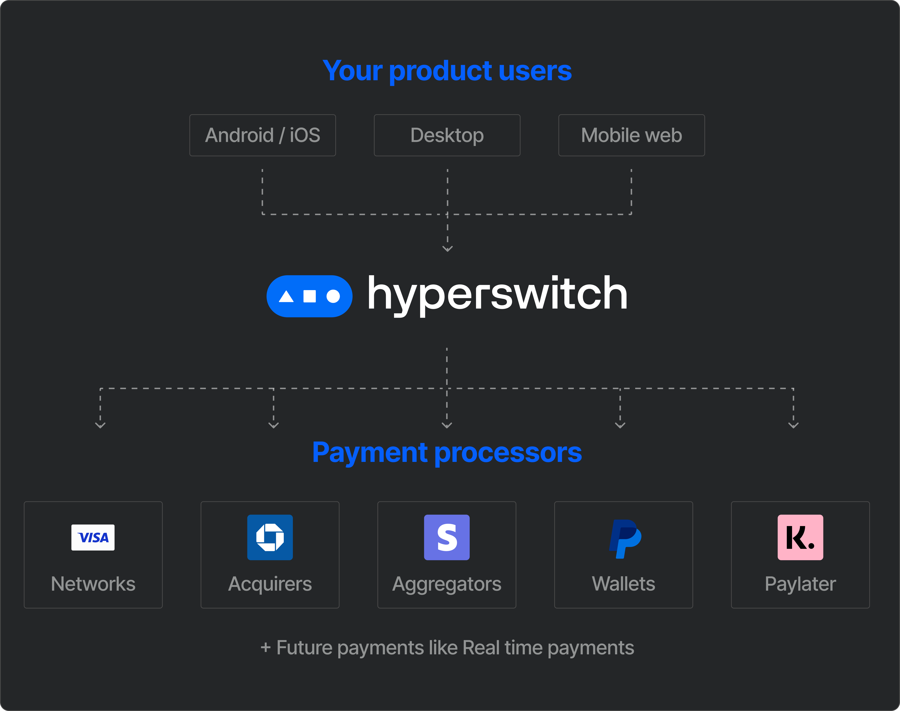

<p align="center">
<svg width="40%" viewBox="0 0 766 100" fill="none" xmlns="http://www.w3.org/2000/svg">
  <g clip-path="url(#clip0_1969_1952)">
    <path d="M370.801 53.4399C370.801 70.0799 360.581 79.9999 346.441 79.9999C338.621 79.9999 331.811 76.7899 328.701 71.4799V99.0399H317.771V27.6899H327.791L328.691 35.5099C331.801 30.1999 338.411 26.6899 346.431 26.6899C360.061 26.6899 370.791 36.2099 370.791 53.4499L370.801 53.4399ZM359.471 53.4399C359.471 42.9199 353.261 36.3999 344.231 36.3999C335.611 36.2999 329.001 42.9099 329.001 53.5399C329.001 64.1699 335.621 70.2799 344.231 70.2799C352.841 70.2799 359.471 63.9699 359.471 53.4399Z" fill="currentColor" />
    <path d="M428.931 56.3498H389.641C389.841 65.9698 396.151 70.9798 404.171 70.9798C410.181 70.9798 415.201 68.1698 417.301 62.5598H428.431C425.721 72.9798 416.501 79.9998 403.971 79.9998C388.631 79.9998 378.511 69.3798 378.511 53.2398C378.511 37.0998 388.631 26.5798 403.871 26.5798C419.111 26.5798 428.931 36.7998 428.931 52.2398V56.3498V56.3498ZM389.741 48.7298H417.801C417.201 39.8098 411.291 35.2998 403.871 35.2998C396.451 35.2998 390.541 39.8098 389.741 48.7298Z" fill="currentColor" />
    <path d="M448.281 27.6899C443.181 27.6899 439.051 31.8199 439.051 36.9199V79.0099H450.081V51.6499V39.8199C450.081 38.5499 451.111 37.5099 452.391 37.5099H469.231V27.6899H448.291H448.281Z" fill="currentColor" />
    <path d="M300.14 27.5898L286.01 70.1898L270.77 27.6898H258.94L278.48 78.3098C279.08 79.9098 279.38 81.2198 279.38 82.5198C279.38 83.2298 279.31 83.8798 279.19 84.4798L279.16 84.5898C279.09 84.9098 279.01 85.2098 278.91 85.4998L278.17 88.2098C277.99 88.8798 277.38 89.3398 276.69 89.3398H261.14V99.0598H272.47C280.09 99.0598 286.4 97.2598 290.01 87.2298L311.56 27.6898L300.13 27.5898H300.14Z" fill="currentColor" />
    <path d="M206.82 78.9999H217.74V51.3399C217.74 42.7199 222.45 36.7099 231.17 36.7099C238.79 36.6099 243.5 41.1199 243.5 51.0399V78.9999H254.43V49.3299C254.43 31.7899 243.71 26.5799 233.98 26.5799C226.56 26.5799 220.75 29.4899 217.74 34.2999V6.63989H206.82V78.9999V78.9999Z" fill="currentColor" />
    <path d="M483.66 63.4699C483.76 68.7799 488.67 71.8899 495.39 71.8899C502.11 71.8899 506.11 69.3799 506.11 64.8699C506.11 60.9599 504.11 58.8599 498.29 57.9499L487.97 56.1499C477.95 54.4499 474.04 49.2299 474.04 41.9199C474.04 32.6999 483.16 26.6899 494.79 26.6899C507.32 26.6899 516.44 32.6999 516.54 42.9299H505.72C505.62 37.7199 501.11 34.8099 494.8 34.8099C488.49 34.8099 484.98 37.3199 484.98 41.5299C484.98 45.2399 487.59 46.9399 493.3 47.9399L503.42 49.7399C512.94 51.4399 517.35 56.1499 517.35 63.8699C517.35 74.4899 507.53 80.0099 495.6 80.0099C482.07 80.0099 472.95 73.4999 472.75 63.4699H483.68H483.66Z" fill="currentColor" />
    <path
      d="M542.19 66.9799L553.82 27.6899H565.25L576.68 66.9799L586.4 27.6899H597.93L583.4 79.0099H571.07L559.44 39.9199L547.71 79.0099H535.28L520.65 27.6899H532.18L542.2 66.9799H542.19Z"
      fill="currentColor" />
    <path d="M604.34 6.63989H616.47V18.0699H604.34V6.63989ZM604.94 27.6899H615.86V79.0099H604.94V27.6899Z"
      fill="currentColor" />
    <path
      d="M685.32 36.1099C676.8 36.1099 670.99 42.3199 670.99 53.2499C670.99 64.7799 677 70.3899 685.02 70.3899C691.43 70.3899 696.15 66.7799 698.25 59.9699H709.88C707.27 72.3999 697.85 80.0199 685.22 80.0199C669.99 80.0199 659.76 69.3999 659.76 53.2599C659.76 37.1199 669.98 26.5999 685.32 26.5999C697.85 26.5999 707.17 33.7199 709.88 46.1399H698.05C696.25 39.7299 691.33 36.1199 685.32 36.1199V36.1099Z"
      fill="currentColor" />
    <path
      d="M642.87 69.2799C642.23 69.2799 641.72 68.7599 641.72 68.1299V37.41H653.65V27.69H641.72V13.95H630.8V22.87C630.8 26.08 629.8 27.68 626.59 27.68H622.18V37.4H630.8V65.0599C630.8 73.9799 635.71 78.99 644.63 78.99H653.55V69.2699H642.88L642.87 69.2799Z"
      fill="currentColor" />
    <path
      d="M745.22 26.5799C737.8 26.5799 731.99 29.4899 728.98 34.2999V6.63989H718.06V78.9999H728.98V51.3399C728.98 42.7199 733.69 36.7099 742.41 36.7099C750.03 36.6099 754.74 41.1199 754.74 51.0399V78.9999H765.67V49.3299C765.67 31.7899 754.95 26.5799 745.22 26.5799V26.5799Z"
      fill="currentColor" />
    <g clip-path="url(#clip1_1969_1952)">
      <path
        d="M135.792 0H42.875C19.1958 0 0 19.1958 0 42.875C0 66.5542 19.1958 85.75 42.875 85.75H135.792C159.471 85.75 178.667 66.5542 178.667 42.875C178.667 19.1958 159.471 0 135.792 0Z"
        fill="#006DF9" />
      <path
        d="M140.261 56.4367C147.751 56.4367 153.822 50.3649 153.822 42.8751C153.822 35.3852 147.751 29.3135 140.261 29.3135C132.771 29.3135 126.699 35.3852 126.699 42.8751C126.699 50.3649 132.771 56.4367 140.261 56.4367Z"
        fill="white" />
      <path
        d="M53.2718 53.4511L39.0877 31.4253C38.7683 30.9299 38.0448 30.9299 37.7254 31.4253L23.5413 53.4511C23.1925 53.9888 23.5804 54.6993 24.2224 54.6993H52.5907C53.2327 54.6993 53.6206 53.9888 53.2718 53.4511V53.4511Z"
        fill="white" />
      <path
        d="M100.55 30.353H78.1172C77.3972 30.353 76.8135 30.9367 76.8135 31.6567V54.0899C76.8135 54.8099 77.3972 55.3936 78.1172 55.3936H100.55C101.27 55.3936 101.854 54.8099 101.854 54.0899V31.6567C101.854 30.9367 101.27 30.353 100.55 30.353Z"
        fill="white" />
    </g>
  </g>
  <defs>
    <clipPath id="clip0_1969_1952">
      <rect width="765.66" height="99.05" fill="white" />
    </clipPath>
    <clipPath id="clip1_1969_1952">
      <rect width="178.667" height="85.75" fill="white" />
    </clipPath>
  </defs>
</svg>
</p>

<p align="center">
<a href="https://github.com/juspay/hyperswitch/actions?query=workflow%3ACI+branch%3Amain">

</a>
<a href="https://github.com/juspay/hyperswitch/blob/main/LICENSE">

</a>
</p>

HyperSwitch is an Open Source Financial Switch to make payments **Fast, Reliable
and Affordable**.
It lets you connect with multiple payment processors and route traffic
effortlessly, all with a single API integration.
Using HyperSwitch, you can:

- **Reduce dependency** on a single processor like Stripe or Braintree
- **Reduce Dev effort** by 90% to add & maintain integrations
- **Improve success rates** with seamless failover and auto-retries
- **Reduce processing fees** with smart routing
- **Customize payment flows** with full visibility and control
- **Increase business reach** with local / alternate payment methods

> HyperSwitch is **wire-compatible** with top processors like Stripe, making it
> easy to integrate.

<p align="center">

</p>

## Table of Contents

- [Quick Start Guide](#quick-start-guide)
- [Fast Integration for Stripe Users](#fast-integration-for-stripe-users)
- [Supported Features](#supported-features)
- [What's Included](#whats-included)
- [Join us in building HyperSwitch](#join-us-in-building-hyperswitch)
- [Community](#community)
- [Bugs and feature requests](#bugs-and-feature-requests)
- [Versioning](#versioning)
- [Copyright and License](#copyright-and-license)

## Quick Start Guide

You have three options to try out HyperSwitch:

1. [Try it in our Sandbox Environment](/docs/try_sandbox.md): Fast and easy to
   start.
   No code or setup required in your system.
2. Try our React Demo App: A simple demo of integrating Hyperswitch with your
   React app.

   <a href="https://github.com/aashu331998/hyperswitch-react-demo-app/archive/refs/heads/main.zip">
   
   </a>

3. [Install in your local system](/docs/try_local_system.md): Configurations and
   setup required in your system.
   Suitable if you like to customize the core offering.

## Fast Integration for Stripe Users

If you are already using Stripe, integrating with HyperSwitch is fun, fast &
easy.
Try the steps below to get a feel for how quick the setup is:

1. Get API keys from our [dashboard].
2. Follow the instructions detailed on our
   [documentation page][migrate-from-stripe].

[dashboard]: https://dashboard-hyperswitch.netlify.app
[migrate-from-stripe]: https://hyperswitch.io/docs/migrateFromStripe

## Supported Features

### Supported Payment Processors and Methods

As of Jan 2023, we support 14 payment processors and multiple payment methods.
In addition, we are continuously integrating new processors based on their reach
and community requests.
Our target is to support 100+ processors by H2 2023.
You can find the latest list of payment processors, supported methods, and
features
[here][supported-connectors-and-features].

[supported-connectors-and-features]: https://docs.google.com/spreadsheets/d/e/2PACX-1vQWHLza9m5iO4Ol-tEBx22_Nnq8Mb3ISCWI53nrinIGLK8eHYmHGnvXFXUXEut8AFyGyI9DipsYaBLG/pubhtml?gid=0&single=true

### Hosted Version

In addition to all the features of the open-source product, our hosted version
provides features and support to manage your payment infrastructure, compliance,
analytics, and operations end-to-end:

- **System Performance & Reliability**

  - Scalable to support 50000 tps
  - System uptime of up to 99.99%
  - Deployment with very low latency
  - Hosting option with AWS or GCP

- **Value Added Services**

  - Compliance Support incl. PCI, GDPR, Card Vault etc
  - Customize the integration or payment experience
  - Control Center with elaborate analytics and reporting
  - Integration with Risk Management Solutions
  - Integration with other platforms like Subscription, E-commerce, Accounting,
    etc.

- **Enterprise Support**

  - 24x7 Email / On-call Support
  - Dedicated Relationship Manager
  - Custom dashboards with deep analytics, alerts, and reporting
  - Expert team to consult and improve business metrics

You can [try the hosted version in our sandbox][dashboard].

<!--
## Documentation

Please refer to the following documentation pages:

- Getting Started Guide [Link]
- API Reference [Link]
- Payments Fundamentals [Link]
- Installation Support [Link]
- Router Architecture [Link]
 -->

## What's Included

Within the repositories you'll find the following directories and files,
logically grouping common assets and providing both compiled and minified
variations.

### Repositories

The current setup contains a single repo, which contains the core payment router
and the various connector integrations under the `src/connector` sub-directory.

<!-- ### Sub-Crates -->

<!--
| Crate | Stability | Master | Docs | Example |
|--------|-----------|-------|:----:|:------:|
| [masking](./crates/masking) | [](https://github.com/emersion/stability-badges#experimental) | []() | [](https://docs.rs/masking) | []() |
| [router](./crates/router) | [](https://github.com/emersion/stability-badges#experimental) | []() | [](https://docs.rs/router) | []() |
-->

### Files Tree Layout

<!-- FIXME: this table should either be generated by a script or smoke test
should be introduced checking it agrees with actual structure -->

```text
├── config                       : config files for router. This stores the initial startup config and separate configs can be provided for debug/release builds.
├── crates                       : sub-crates
│   ├── masking                  : making pii information for pci and gdpr compliance
│   ├── router                   : the main crate
│   └── router_derive            : utility macros for the router crate
├── docs                         : hand written documentation
├── examples                     : examples
├── logs                         : logs generated at runtime
├── migrations                   : diesel db setup
├── openapi                      : API definition
├── postman                      : postman scenarios for API
└── target                       : generated files
```

## Join us in building HyperSwitch

### Our Belief

> Payments should be open, fast, reliable and affordable to serve
> the billions of people at scale.

<!--
HyperSwitch would allow everyone to quickly customize and set up an open payment
switch, while giving a unified experience to your users, abstracting away the
ever shifting payments landscape.

The HyperSwitch journey starts with a payment orchestrator.
It was born from our struggle to understand and integrate various payment
options/payment processors/networks and banks, with varying degrees of
documentation and inconsistent API semantics. -->

Globally payment diversity has been growing at a rapid pace.
There are hundreds of payment processors and new payment methods like BNPL,
RTP etc.
Businesses need to embrace this diversity to increase conversion, reduce cost
and improve control.
But integrating and maintaining multiple processors needs a lot of dev effort.
Why should devs across companies repeat the same work?
Why can't it be unified and reused? Hence, HyperSwitch was born to create that
reusable core and let companies build and customize on top of it.

### Our Values

1. Embrace Payments Diversity: It will drive innovation in the ecosystem in
   multiple ways.
2. Make it Open Source: Increases trust; Improves the quality and reusability of
   software.
3. Be Community driven: It enables participatory design and development.
4. Build it like Systems Software: This sets a high bar for Reliability,
   Security and Performance SLAs.
5. Maximize Value Creation: For developers, customers & partners.

### Contributing

This project is being created and maintained by [Juspay](https://juspay.in),
South Asia's largest payments orchestrator/switch, processing more than 50
Million transactions per day. The solution has 1Mn+ lines of Haskell code built
over 10 years.
HyperSwitch leverages our experience in building large-scale, enterprise-grade &
frictionless payment solutions.
It is built afresh for the global markets as an open-source product in Rust.
We are long-term committed to building and making it useful for the community.

The product roadmap is open for the community's feedback.
We shall evolve a prioritization process that is open and community-driven.
We welcome contributions from the community. Please read through our
[contributing guidelines](/docs/CONTRIBUTING.md).
Included are directions for opening issues, coding standards, and notes on
development.

Important note for Rust developers: We aim for contributions from the community
across a broad range of tracks. Hence, we have prioritized simplicity and code
readability over purely idiomatic code. For example, some of the code in core
functions (e.g., `payments_core`) is written to be more readable than
pure-idiomatic.

## Community

Get updates on HyperSwitch development and chat with the community:

- Read and subscribe to [the official HyperSwitch blog][blog].
- Join our [Discord server][discord].
- Join our [Slack workspace][slack].
- Ask and explore our [GitHub Discussions][github-discussions].

[blog]: https://blog.hyperswitch.io
[discord]: https://discord.gg/wJZ7DVW8mm
[slack]: https://join.slack.com/t/hyperswitch-io/shared_invite/zt-1k6cz4lee-SAJzhz6bjmpp4jZCDOtOIg
[github-discussions]: https://github.com/juspay/hyperswitch/discussions

## Bugs and feature requests

Please read the issue guidelines and search for [existing and closed issues].
If your problem or idea is not addressed yet, please [open a new issue].

[existing and closed issues]: https://github.com/juspay/hyperswitch/issues
[open a new issue]: https://github.com/juspay/hyperswitch/issues/new/choose

## Versioning

Check the [CHANGELOG.md](./CHANGELOG.md) file for details.

## Copyright and License

This product is licensed under the [Apache 2.0 License](LICENSE).
